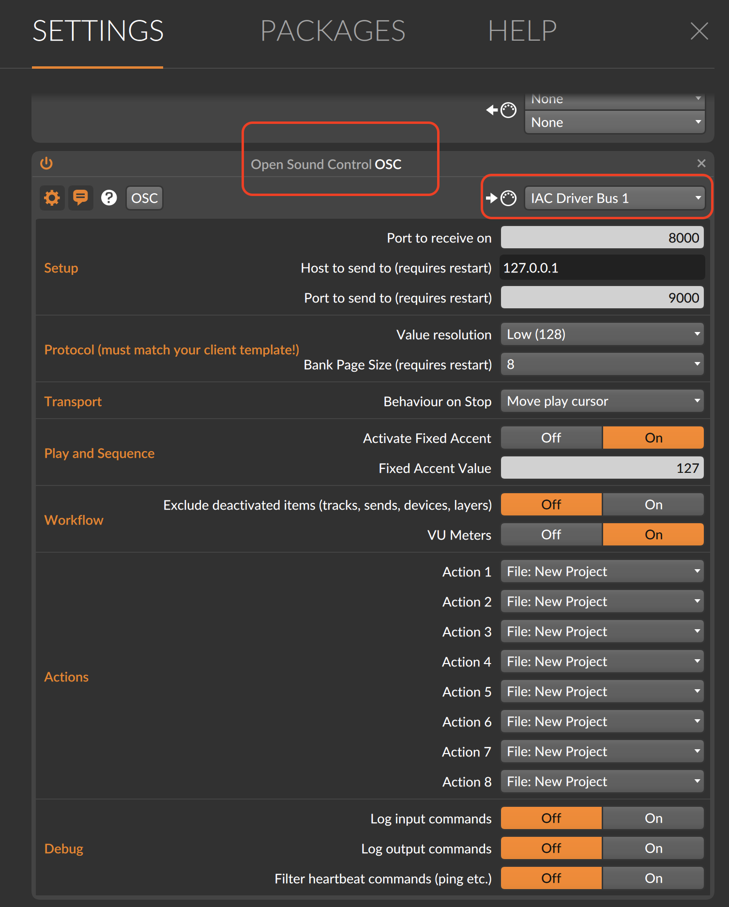
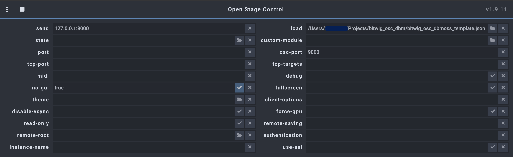
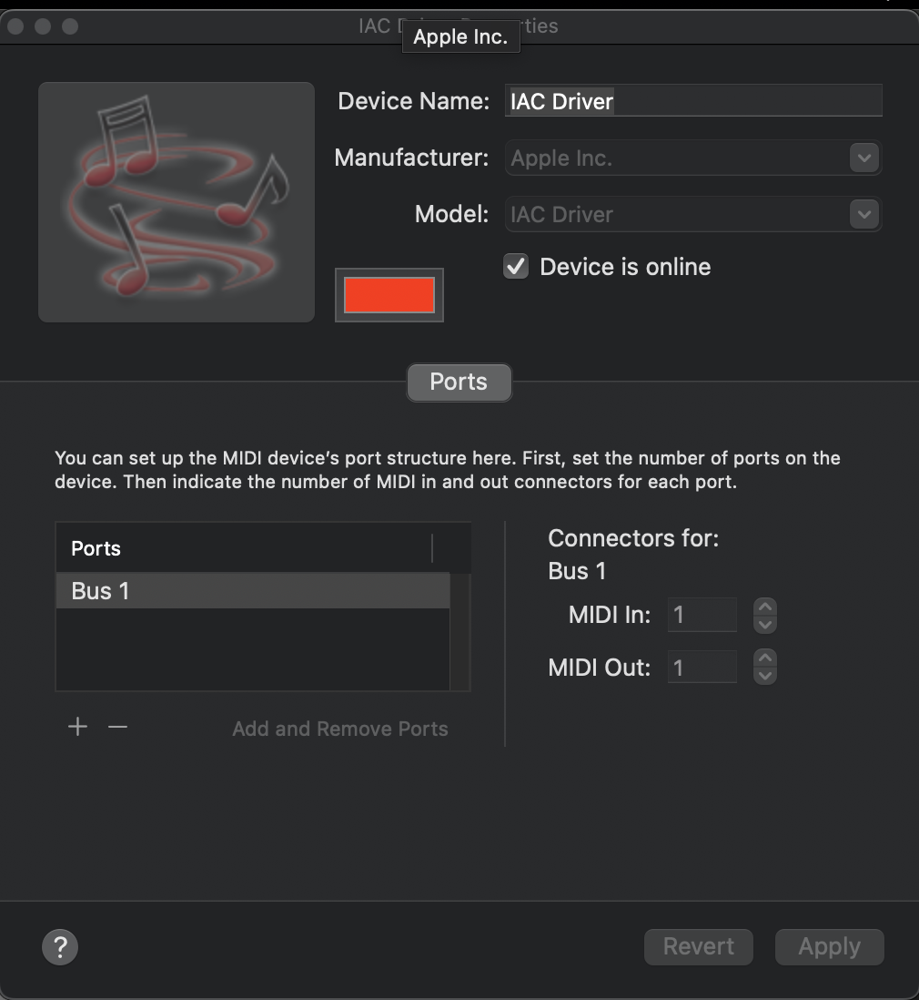
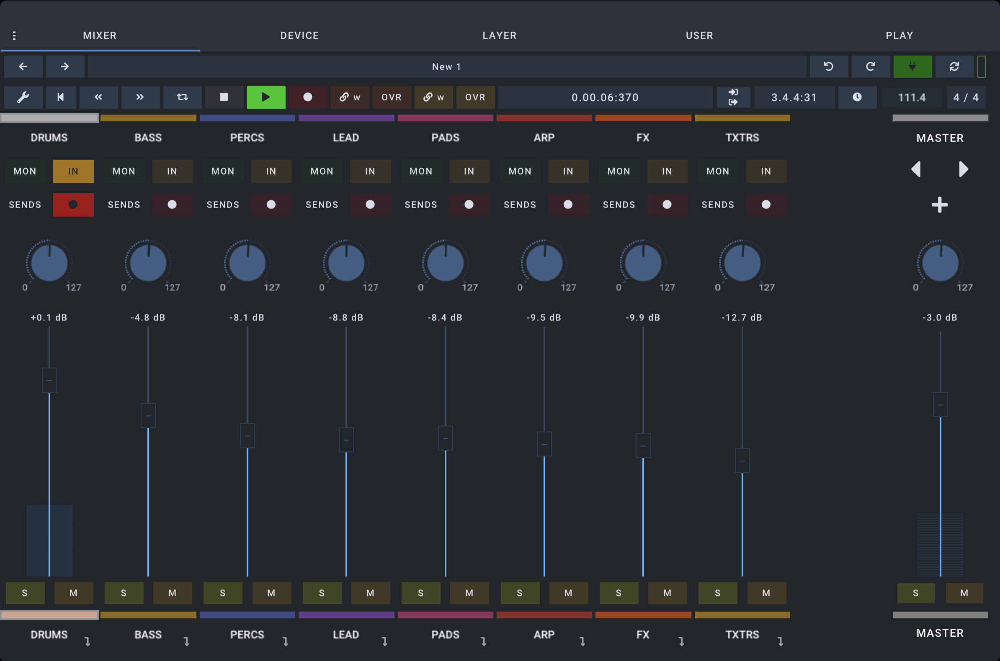
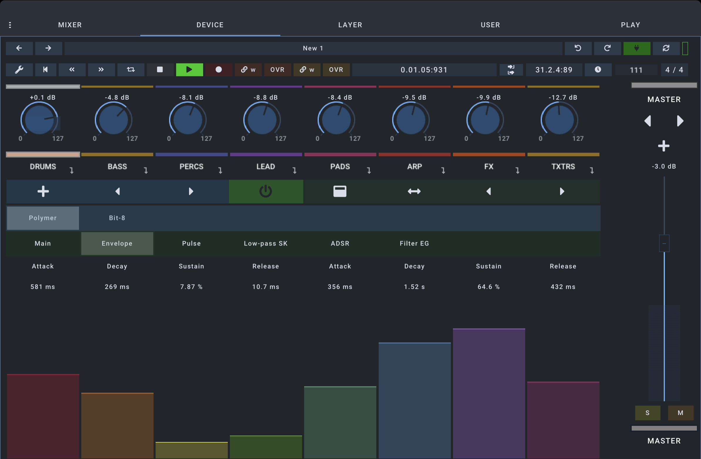

# Open Stage Control template for Bitwig
A modified and restyled version of the template provided by Jurgen in his DrivenByMoss OSC extension.
You can use any device that has a web browser, to remotely control Bitwig studio.
On an iPad I recommend using an app called FullScreen Browser for a full screen experience

## Dependencies
- [DrivenByMoss](http://mossgrabers.de/Software/Bitwig/Bitwig.html):
An Bitwig extension that communicates with the Bitwig  api to send and receive OSC messages. Follow the instructions to setup and add an OSC controller in Bitwig controllers.

- [Open Stage Control](https://openstagecontrol.ammd.net/): a web application that allows you to build and run templates that send OSC commands to Bitwig

## Setup - Bitwig

## Setup - Open Stage Control
 v1.9.11

## Setup - IAC Drive (Mac)

## Views
### Mixer view

### Device view

